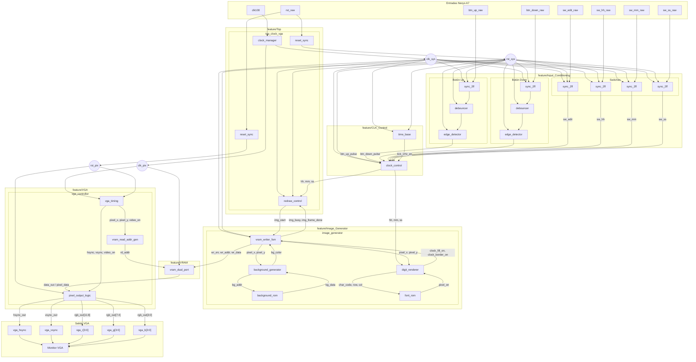

```mermaid
flowchart TD

    %% =========================
    %% Entradas
    %% =========================
    subgraph INPUTS [Entradas Nexys A7]
        direction TB
        clk100[clk100]
        rst_raw[rst_raw]
        btn_up_raw[btn_up_raw]
        btn_down_raw[btn_down_raw]
        sw_edit_raw[sw_edit_raw]
        sw_hh_raw[sw_hh_raw]
        sw_mm_raw[sw_mm_raw]
        sw_ss_raw[sw_ss_raw]
    end

    %% =========================
    %% feature/Top
    %% =========================
    subgraph TOP_BRANCH [feature/Top]
        direction TB
        subgraph TOPMOD [top_clock_vga]
            direction TB
            clock_manager[clock_manager]
            reset_sync_sys[reset_sync]
            reset_sync_pix[reset_sync]
            redraw_control[redraw_control]
        end
    end

    %% =========================
    %% Buses de reloj y reset
    %% =========================
    clk_sys_bus((clk_sys))
    clk_pix_bus((clk_pix))
    rst_sys_bus((rst_sys))
    rst_pix_bus((rst_pix))

    %% =========================
    %% feature/Input_Conditioning
    %% =========================
    subgraph INPUT_BRANCH [feature/Input_Conditioning]
        direction TB

        subgraph BTN_UP_PATH [Botón Up]
            direction TB
            btn_up_sync[sync_2ff]
            btn_up_debounce[debouncer]
            btn_up_edge[edge_detector]
        end

        subgraph BTN_DOWN_PATH [Botón Down]
            direction TB
            btn_down_sync[sync_2ff]
            btn_down_debounce[debouncer]
            btn_down_edge[edge_detector]
        end

        subgraph SWITCH_PATH [Switches]
            direction TB
            sw_edit_sync[sync_2ff]
            sw_hh_sync[sync_2ff]
            sw_mm_sync[sync_2ff]
            sw_ss_sync[sync_2ff]
        end
    end

    %% =========================
    %% feature/CLK_Control
    %% =========================
    subgraph CLK_BRANCH [feature/CLK_Control]
        direction TB
        time_base[time_base]
        clock_control[clock_control]
    end

    %% =========================
    %% feature/Image_Generator
    %% =========================
    subgraph IMG_BRANCH [feature/Image_Generator]
        direction TB
        subgraph IMG_GEN [image_generator]
            direction TB
            background_gen[background_generator]
            background_rom[background_rom]
            digit_renderer[digit_renderer]
            font_rom[font_rom]
            vram_writer[vram_writer_fsm]
        end
    end

    %% =========================
    %% feature/VRAM
    %% =========================
    subgraph VRAM_BRANCH [feature/VRAM]
        direction TB
        vram_dual_port[vram_dual_port]
    end

    %% =========================
    %% feature/VGA
    %% =========================
    subgraph VGA_BRANCH [feature/VGA]
        direction TB
        subgraph VGA_CTRL [vga_controller]
            direction TB
            vga_timing[vga_timing]
            addr_gen[vram_read_addr_gen]
            pixel_logic[pixel_output_logic]
        end
    end

    %% =========================
    %% Salidas
    %% =========================
    subgraph OUTPUTS [Salida VGA]
        direction TB
        vga_hsync[vga_hsync]
        vga_vsync[vga_vsync]
        vga_r["vga_r[3:0]"]
        vga_g["vga_g[3:0]"]
        vga_b["vga_b[3:0]"]
        monitor[Monitor VGA]
    end

    %% =========================
    %% Entradas al Top
    %% =========================
    clk100 --> clock_manager
    rst_raw --> reset_sync_sys
    rst_raw --> reset_sync_pix

    %% =========================
    %% Distribución de relojes
    %% =========================
    clock_manager --> clk_sys_bus
    clock_manager --> clk_pix_bus

    clk_sys_bus --> btn_up_sync
    clk_sys_bus --> btn_down_sync
    clk_sys_bus --> sw_edit_sync
    clk_sys_bus --> sw_hh_sync
    clk_sys_bus --> sw_mm_sync
    clk_sys_bus --> sw_ss_sync
    clk_sys_bus --> time_base
    clk_sys_bus --> clock_control
    clk_sys_bus --> redraw_control
    clk_sys_bus --> vram_writer

    clk_pix_bus --> vga_timing
    clk_pix_bus --> vram_dual_port

    %% =========================
    %% Distribución de reset
    %% =========================
    reset_sync_sys --> rst_sys_bus
    reset_sync_pix --> rst_pix_bus

    rst_sys_bus --> btn_up_sync
    rst_sys_bus --> btn_up_debounce
    rst_sys_bus --> btn_up_edge
    rst_sys_bus --> btn_down_sync
    rst_sys_bus --> btn_down_debounce
    rst_sys_bus --> btn_down_edge
    rst_sys_bus --> sw_edit_sync
    rst_sys_bus --> sw_hh_sync
    rst_sys_bus --> sw_mm_sync
    rst_sys_bus --> sw_ss_sync
    rst_sys_bus --> time_base
    rst_sys_bus --> clock_control
    rst_sys_bus --> redraw_control
    rst_sys_bus --> vram_writer

    rst_pix_bus --> vga_timing
    rst_pix_bus --> pixel_logic

    %% =========================
    %% Caminos de botones
    %% =========================
    btn_up_raw --> btn_up_sync
    btn_up_sync --> btn_up_debounce
    btn_up_debounce --> btn_up_edge
    btn_up_edge -- "btn_up_pulse" --> clock_control

    btn_down_raw --> btn_down_sync
    btn_down_sync --> btn_down_debounce
    btn_down_debounce --> btn_down_edge
    btn_down_edge -- "btn_down_pulse" --> clock_control

    %% =========================
    %% Caminos de switches
    %% =========================
    sw_edit_raw --> sw_edit_sync
    sw_hh_raw --> sw_hh_sync
    sw_mm_raw --> sw_mm_sync
    sw_ss_raw --> sw_ss_sync

    sw_edit_sync -- "sw_edit" --> clock_control
    sw_hh_sync -- "sw_hh" --> clock_control
    sw_mm_sync -- "sw_mm" --> clock_control
    sw_ss_sync -- "sw_ss" --> clock_control

    %% =========================
    %% Control de hora
    %% =========================
    time_base -- "tick_1Hz_en" --> clock_control
    clock_control -- "hh, mm, ss" --> redraw_control
    clock_control -- "hh, mm, ss" --> digit_renderer

    %% =========================
    %% Redibujado
    %% =========================
    redraw_control -- "img_start" --> vram_writer
    vram_writer -- "img_busy, img_frame_done" --> redraw_control

    %% =========================
    %% Interior de image_generator
    %% =========================
    vram_writer -- "pixel_x, pixel_y" --> background_gen
    vram_writer -- "pixel_x, pixel_y" --> digit_renderer

    background_gen -- "bg_addr" --> background_rom
    background_rom -- "bg_data" --> background_gen

    digit_renderer -- "char_code, row, col" --> font_rom
    font_rom -- "pixel_on" --> digit_renderer

    background_gen -- "bg_color" --> vram_writer
    digit_renderer -- "clock_fill_on, clock_border_on" --> vram_writer

    %% =========================
    %% Escritura en VRAM
    %% =========================
    vram_writer -- "wr_en, wr_addr, wr_data" --> vram_dual_port

    %% =========================
    %% Lectura VGA
    %% =========================
    vga_timing -- "pixel_x, pixel_y, video_on" --> addr_gen
    addr_gen -- "rd_addr" --> vram_dual_port
    vram_dual_port -- "data_out / pixel_data" --> pixel_logic
    vga_timing -- "hsync, vsync, video_on" --> pixel_logic

    %% =========================
    %% Salidas finales
    %% =========================
    pixel_logic -- "hsync_out" --> vga_hsync
    pixel_logic -- "vsync_out" --> vga_vsync
    pixel_logic -- "rgb_out[11:8]" --> vga_r
    pixel_logic -- "rgb_out[7:4]" --> vga_g
    pixel_logic -- "rgb_out[3:0]" --> vga_b

    vga_hsync --> monitor
    vga_vsync --> monitor
    vga_r --> monitor
    vga_g --> monitor
    vga_b --> monitor
```