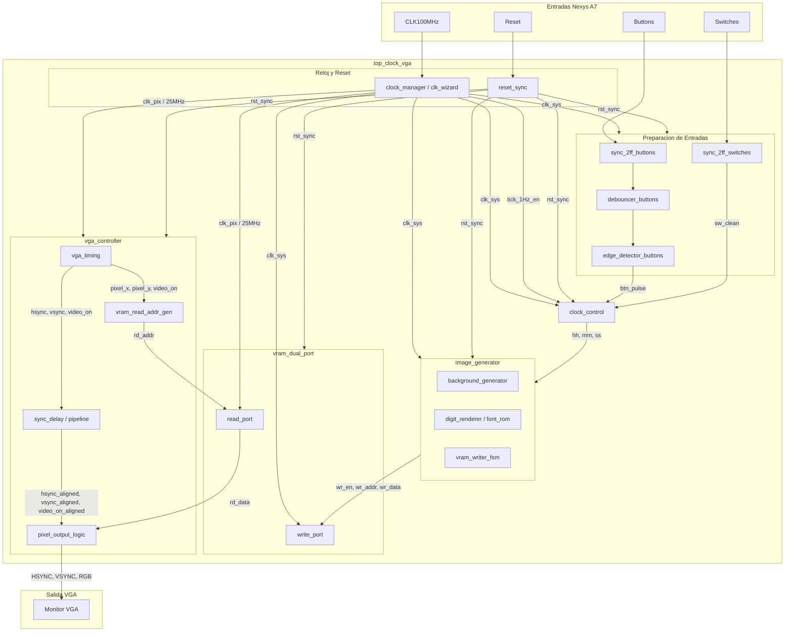

```mermaid
flowchart TD

    %% Entradas y salida
    subgraph INPUTS [Entradas Nexys A7]
        CLK100[CLK100MHz]
        RESET_RAW[Reset]
        BUTTONS_RAW[Buttons]
        SWITCHES_RAW[Switches]
    end

    subgraph OUTPUTS [Salida VGA]
        MONITOR[Monitor VGA]
    end

    %% Top
    subgraph TOP [top_clock_vga]

        %% Relojes y reset
        subgraph CLK_RST [Reloj y Reset]
            clock_manager[clock_manager / clk_wizard]
            reset_sync[reset_sync]
        end

        %% Preparacion de entradas
        subgraph INPUT_PREP [Preparacion de Entradas]
            btn_sync[sync_2ff_buttons]
            btn_debounce[debouncer_buttons]
            btn_edge[edge_detector_buttons]
            sw_sync[sync_2ff_switches]
        end

        %% Control de hora
        clock_control[clock_control]

        %% Generador de imagen
        subgraph IMG_GEN [image_generator]
            background_gen[background_generator]
            digit_renderer[digit_renderer / font_rom]
            vram_writer[vram_writer_fsm]
        end

        %% VRAM
        subgraph VRAM [vram_dual_port]
            wr_port[write_port]
            rd_port[read_port]
        end

        %% Controlador VGA
        subgraph VGA_CTRL [vga_controller]
            vga_timing[vga_timing]
            addr_gen[vram_read_addr_gen]
            sync_delay[sync_delay / pipeline]
            pixel_logic[pixel_output_logic]
        end
    end

    %% Relojes y reset
    CLK100 --> clock_manager
    RESET_RAW --> reset_sync

    clock_manager -- "clk_sys" --> INPUT_PREP
    clock_manager -- "clk_sys" --> clock_control
    clock_manager -- "clk_sys" --> IMG_GEN
    clock_manager -- "clk_sys" --> wr_port
    clock_manager -- "clk_pix / 25MHz" --> VGA_CTRL
    clock_manager -- "clk_pix / 25MHz" --> rd_port
    clock_manager -- "tick_1Hz_en" --> clock_control

    reset_sync -- "rst_sync" --> INPUT_PREP
    reset_sync -- "rst_sync" --> clock_control
    reset_sync -- "rst_sync" --> IMG_GEN
    reset_sync -- "rst_sync" --> VGA_CTRL
    reset_sync -- "rst_sync" --> VRAM

    %% Preparacion de botones y switches
    BUTTONS_RAW --> btn_sync
    btn_sync --> btn_debounce
    btn_debounce --> btn_edge
    btn_edge -- "btn_pulse" --> clock_control

    SWITCHES_RAW --> sw_sync
    sw_sync -- "sw_clean" --> clock_control

    %% Hora hacia generador de imagen
    clock_control -- "hh, mm, ss" --> IMG_GEN

    %% Escritura a VRAM
    IMG_GEN -- "wr_en, wr_addr, wr_data" --> wr_port

    %% Lectura VGA desde VRAM
    vga_timing -- "pixel_x, pixel_y, video_on" --> addr_gen
    addr_gen -- "rd_addr" --> rd_port
    rd_port -- "rd_data" --> pixel_logic

    vga_timing -- "hsync, vsync, video_on" --> sync_delay
    sync_delay -- "hsync_aligned, vsync_aligned, video_on_aligned" --> pixel_logic

    %% Salida al monitor
    pixel_logic -- "HSYNC, VSYNC, RGB" --> MONITOR
```